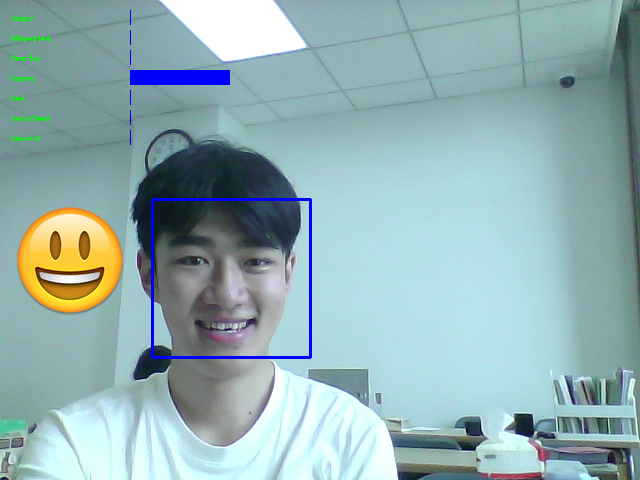

# Raspberry-Hi
Raspberry Hi is a real-time facial emotion recognition system. 
If a face is detected, a bounding box will appear indicating the location of face. \
Meanwhile, a vertical bar chart will visualize the score for each emotion catagory. An emoji correspoing the highest score will appear on the left.

System:
Hardware: Raspberry Pi 3, RPi Camera Module v2\
OS: Raspbian Stretch\
Software:\
Python packages: Tensorflow Lite, Numpy, OpenCV\
Neural Networks: Google Inception v3 and a manual shawllow CNN\
Dataset: fer2013, JAFFE

To train from scratch:
```python3
python3 main.py
```

To load trained model:
Modify the mode.py file - MODE: demo -> train
```python3
python3 main.py
```

To capture a snapshot:\
SPACE key

Performance: 61.5% on fer2013 dataset


